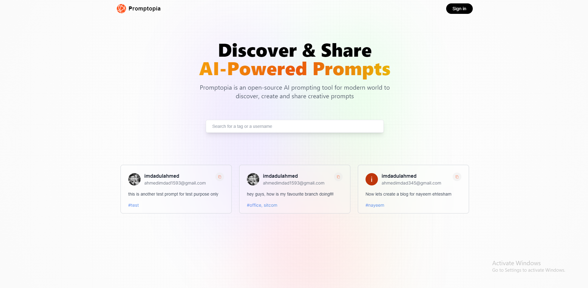

# Lets Prompt is a full stack NextJS app which lets you store and see various useful prompts that you can use in chatgpt and/or other AI tool.

## Introduction
Next.js recently became the official React framework as outlined in React docs. In building this web app, I've learnt the most important Next.js concepts and how they fit into the React ecosystem.
 
In this web app, I've implemented
- Next.js 13 App Folder Structure
- Next.js 13 Client Components vs Server Components
- Next.js 13 File-based Routing (including dynamic and nested routes)
- Next.js 13 page, layout, loading, and error Special Files
- Next.js 13 Serverless Route Handlers (Next API, Full Stack Apps)
- Next.js 13 Metadata and Search Engine Optimization (SEO)
- Three ways to fetch data in Next.js:
   - Server Side Rendering (SSR),
   - Static Site Generation (SSG)
   - Incremental Static Generation (ISR)

